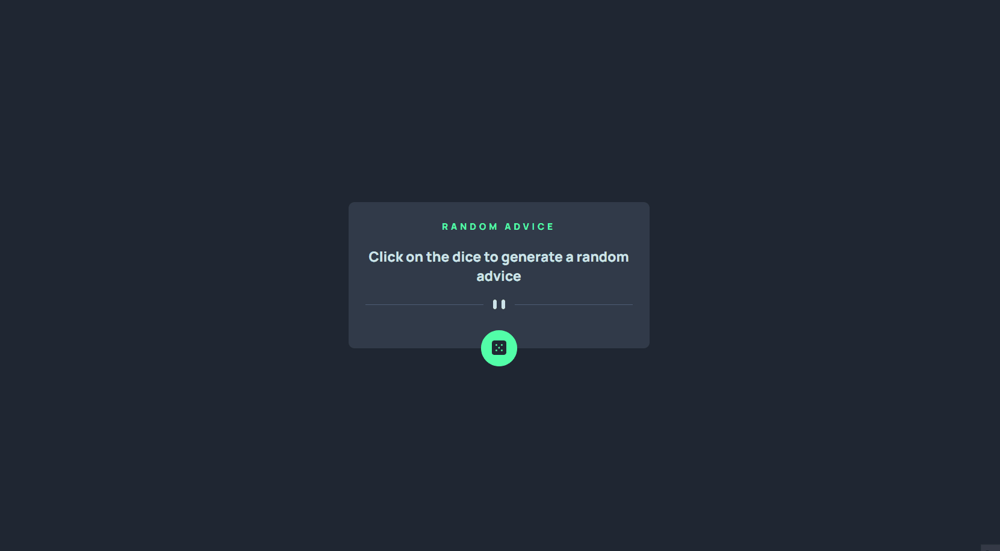

# Frontend Mentor | Desafio Advice Generator App

## Tabela do Conteudo

<ul>
<li><a href="#sobre">Sobre</a></li>
<li><a href="#status">Status</a></li>
<li><a href="#objetivo">Objetivo</a></li>
<li><a href="#curiosidade">Curiosidade</a></li>
<li><a href="#tecnologias">Tecnologias</a></li>
<li><a href="#acessando-o-site">Acessando o site</a></li>
</ul>

## Sobre

### Resolução do desafio do [Frontend Mentor](https://www.frontendmentor.io/challenges/advice-generator-app-QdUG-13db) criando um gerador de conselhos.

### Desafio proposto:

### Minha solução:
#### Layout Desktop | Mobile.

## Status

Desafio concluído! 👌

## Objetivo

Com base nos conceitos adquiridos do curso Dev Quest, tinha como objetivo tornar o site o mais próximo do modelo original e utilizar das palavras-chaves o `Async` e `Await` para trabalhar com o retorno da `Promisse` da API Advice Generator.

## Curiosidade

Esse desafio me permitiu analisar o documento da API e, então, por em prática oque aprendi no curso.

## Tecnologias

<ul>
<li>HTML</li>
<li>CSS</li>
<li>JavaScript</li>
<li>GIT BASH</li>
</ul>

## Acessando o site

Para acessar o site do Desafio Advice Generator App, por favor use esse link: <a href="https://tiago-forward.github.io/desafio-advice-generator-app-main/" target="_blank">Frontend Mentor | Desafio Advice Generator App</a>